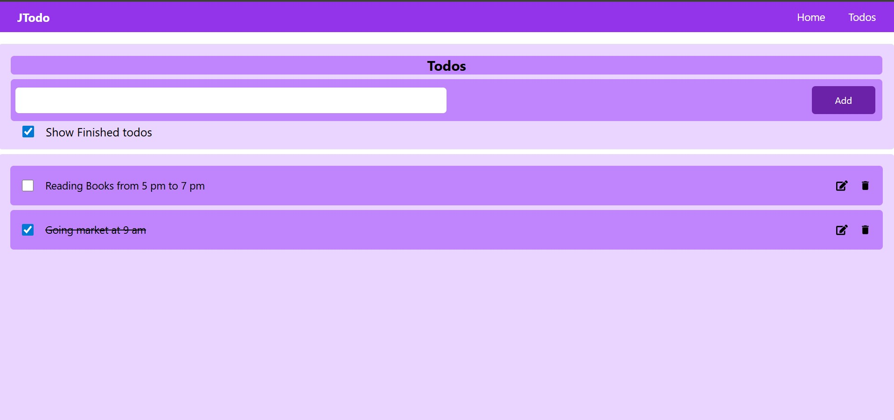

# 📝 TODO Web App

<p align="center">
  <!-- Add your project image or screenshot here -->
  
</p>

## 📌 About the Project
This project is a fully functional **TODO Web Application** built using **React.js** and **Node.js**.  
It allows users to manage their daily tasks efficiently with features like task creation, updates, deletion, and completion tracking.  

The app ensures a **seamless experience** with a responsive design and real-time task management.  
Additionally, **localStorage** is integrated to persist data locally, so even after refreshing the page, all tasks remain intact.

---

## ✨ Features
- ➕ Add new tasks  
- ✏️ Edit existing tasks  
- 🗑️ Delete tasks  
- ✅ Mark tasks as completed  
- 💾 Data persistence with **localStorage**  
- 📱 Fully responsive design (Mobile, Tablet, Desktop)  
- ⚡ Real-time updates for smooth task management  

---

## 🛠️ Tech Stack
- **Frontend:** React.js, TailwindCSS (Responsive UI)   
- **Storage:** Browser LocalStorage  

---

## 🚀 Getting Started

### Prerequisites
Make sure you have installed:
- [Node.js](https://nodejs.org/) (v14+ recommended)  
- npm or yarn  

### Installation
```bash
# Clone the repository
git clone https://github.com/JoySarkar07/my_todo_app.git

# Navigate to the project folder
cd my_todo_app

# Install dependencies
npm install
```

# Start development server
```bash
npm run dev
```